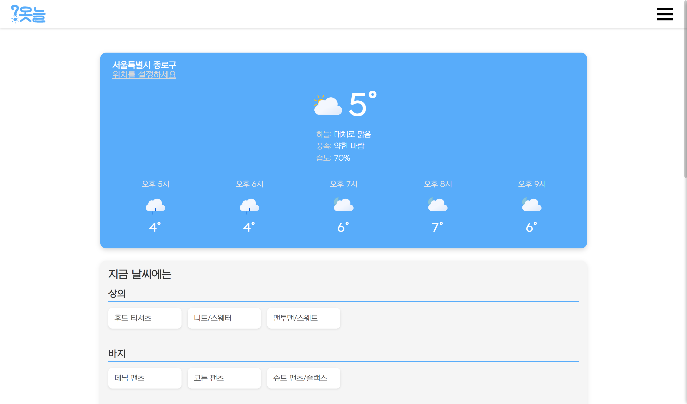
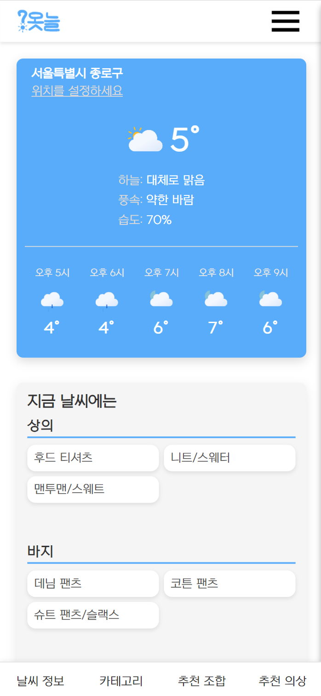
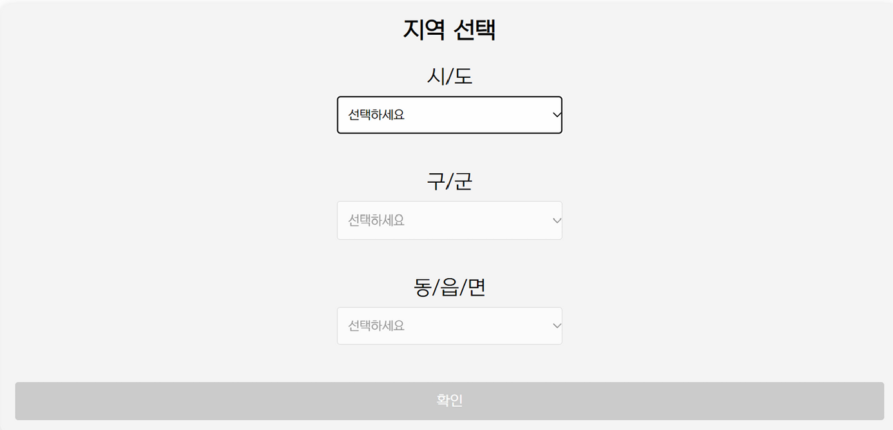
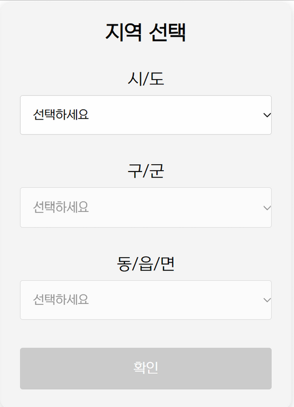
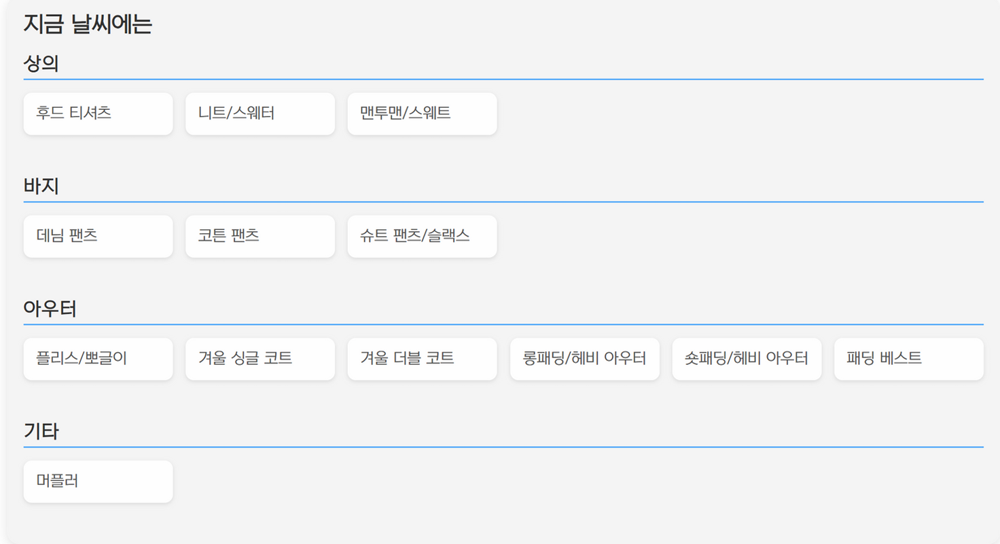
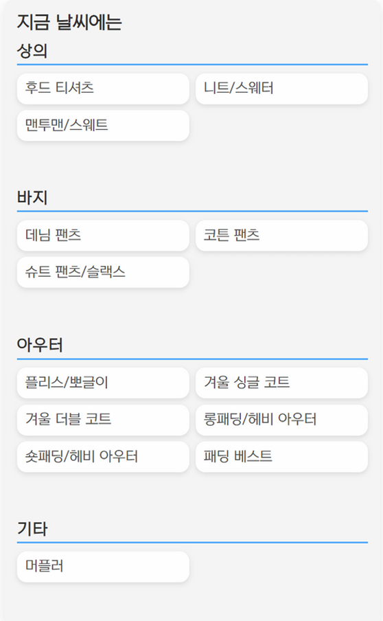
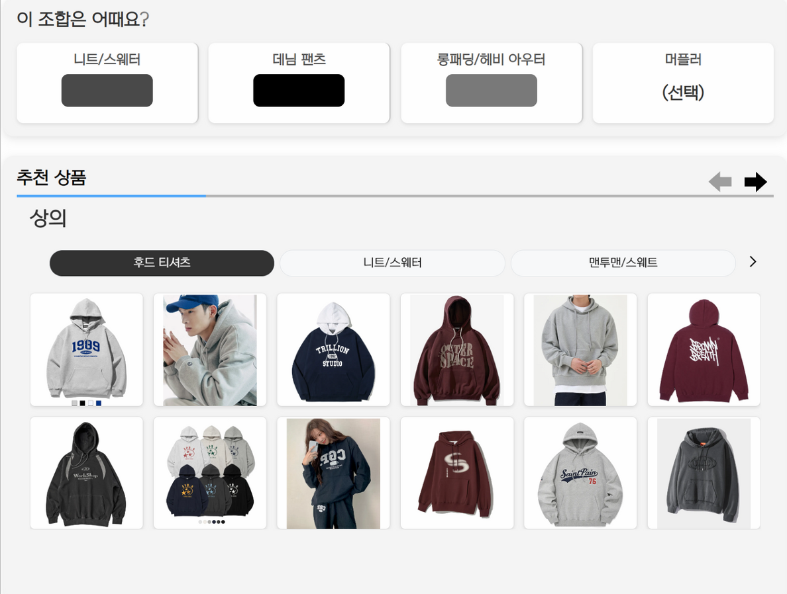
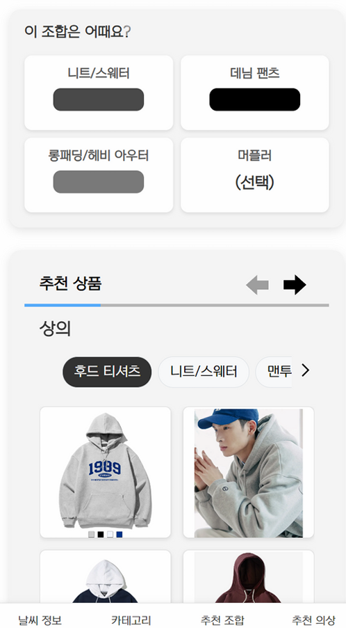

# 옷늘 

## 🌟 Description 
- 실시간 날씨 정보를 기반으로 적합한 의류 스타일과 실제 상품까지 추천하는 웹 서비스입니다.   

## 📱 Demo 
### 첫 화면
 

### 지역 선택
 

### 의류 목록
 

### 조합 및 상품 추천
 

  

## 🔧 Main Feature 
#### 실시간 날씨 정보 제공
- 사용자의 지역 정보의 실시간 날씨 정보를 제공합니다.

#### 기온에 따른 의류 목록 제공
- 현재 온도에 입기 적절한 의류 목록을 표시합니다.

#### 조합 및 실제 상품 추천
- 추천 의류-색상 조합을 생성하여 제공합니다. 
- 제공된 의류 목록에 해당하는 추천 상품 목록을 제공합니다.  

  

## 💻 Technology Stack 
#### Front-end
- HTML, CSS, JavaScript
- Thymeleaf
- PWA
#### Back-end
- Java
- Spring Boot, JPA, Hibernate
- Selenium
#### Database
- MySQL
#### DevOps & Infrastructure
- AWS (EC2, RDS)
- Docker
- Cloudflare
#### APIs
- 기상청 단기예보 API

  

## 👥 Team Member 
#### **강민규** ([M1nkyu](https://github.com/M1nKyu)):
- **데이터베이스 설계**: 프로젝트에 필요한 데이터베이스 및 관계 설계
- **시스템 설계**: 전체 아키텍처 및 기술 스택 결정, 프로젝트 디렉토리 구조 설계
- **기능 구현**:
	- 날씨 API 사용 및 날씨 데이터 처리/표시
 	- 상품 크롤링, 크롤링 자동화/비동기 수행
 	- 의류 목록 및 추천 조합 및 상품 목록 생성/표시
- **도커빌드**
- **배포**
	- AWS의 EC2와 RDS를 활용한 배포
 	- cloudflare를 사용하여 HTTPS 연결
- **버전관리**: GitHub 레포지토리 생성 및 관리, 커밋 규칙 설정
- **문서화**: README 작성, GitHub Wiki 작성
#### **전재억** ([eokjae](https://github.com/eokjae)):
- 
- 
#### **최강희** ([kangheechoi](https://github.com/kangheechoi)):
- 

  

## 📖 Wiki 
- [Developer Menual](https://github.com/M1nKyu/weather-clothes/wiki/%F0%9F%91%A8%F0%9F%8F%BC%E2%80%8D%F0%9F%92%BB-Developer-Menual)
- [개발 목표]()
